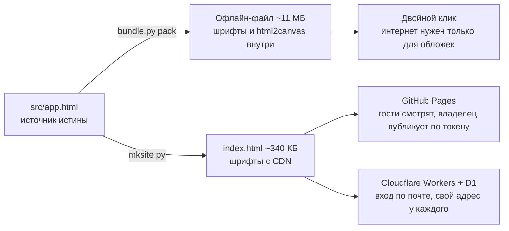
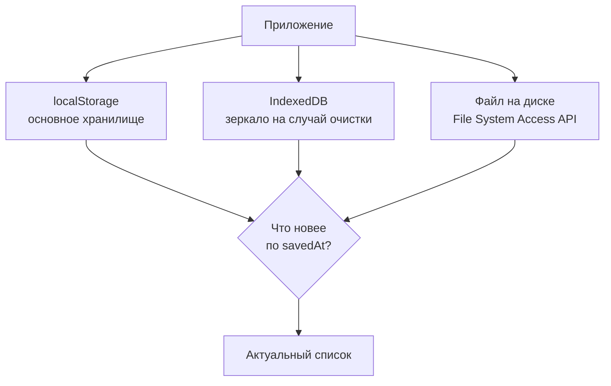

<div align="center">

# アニメ · Тир-лист

**Личный тир-лист аниме — не рейтинг для интернета, а память о просмотренном.**

Один HTML-файл. Открывается двойным кликом, работает без интернета,
данные остаются у вас.

[Скачать офлайн-версию](NEWAnime%20tier%20list11-08-2026.html) ·
[Мой список (60 тайтлов)](data.json) ·
[Исходник](src/app.html) ·
[Серверная часть](site/)

</div>

---

## Зачем

Я смотрю много и в разное время, и в какой-то момент перестал помнить очевидные
вещи: что уже досмотрел, что бросил на середине, когда именно это было и почему
тайтл вообще зацепил.

Списки на сторонних сайтах эту задачу не решали: там чужие оценки, чужие
категории, регистрация и вечный риск, что сервис однажды закроется вместе со
всеми данными.

Поэтому появился свой инструмент.

## Тиры

Тайтлы разложены по тирам и отсортированы не по «объективному качеству», а по
силе впечатления.

| Тир | Название | Смысл | На 11.08.2026 |
|:---:|---|---|:---:|
| **S** | Шедевры | То, после чего долго не хочется включать следующее | 15 |
| **A** | Близко к идеалу | Почти безупречно: замысел, чувство и форма сходятся | 16 |
| **B** | Крепкая основа | Со своим голосом и силой, пусть и не без шероховатостей | 15 |
| **C** | Достойные | Не без слабостей, но знакомство того стоило | 14 |

Это лишь стартовый набор. Тиры свои: до восьми штук, каждому — своё имя,
описание и цветовой акцент из четырнадцати.

## Возможности

### Список

| | |
|---|---|
| **Два вида** | сетка постеров или компактные чипы |
| **Перетаскивание** | мышью и пальцем, меняет и порядок внутри тира, и сам тир |
| **Поиск и фильтр** | по названию, отдельно «только любимые» |
| **Реакции** | сердце, золотое сердце, молния, огонь, звезда |
| **Даты просмотра** | в том числе по сезонам и частям отдельно — ради этого всё и затевалось |
| **Добавление списком** | когда нужно занести десяток названий за раз |
| **Обложки** | подставляются автоматически, с проверкой ссылки прямо в окне правки |

### Оформление

Четыре готовые сцены фона — **Аврора**, **Угли**, **Бездна**, **Сакура** — и
своя фотография с настройкой размытия, затемнения и насыщенности. Эффекты
(неон, свечение, частицы, курсорный ореол) включаются и гасятся по отдельности.

### Статистика вкуса

Список сам определяет профиль по распределению тайтлов и отметок:
_Сенсей старой школы_, _Романтик эпохи Рэйва_, _Любопытный исследователь_,
_Взыскательный критик_, _Дзен-куратор_.

### Горячие клавиши

| Клавиша | Действие |
|:---:|---|
| <kbd>N</kbd> | добавить тайтл |
| <kbd>E</kbd> | режим правки |
| <kbd>G</kbd> / <kbd>C</kbd> | сетка постеров / чипы |
| <kbd>/</kbd> | поиск |
| <kbd>Tab</kbd> | обход карточек, <kbd>Enter</kbd> или <kbd>Пробел</kbd> открывает правку |
| <kbd>Esc</kbd> | закрыть окно |

## Как это запускается

Одно и то же приложение живёт в трёх видах — режим определяется при загрузке.



| Способ | Что нужно | Кто может править |
|---|---|---|
| **Офлайн-файл** | ничего | вы, на своём компьютере |
| **GitHub Pages** | публичный репозиторий | владелец с токеном, остальные — только смотрят |
| **Cloudflare Workers** | аккаунт Cloudflare | каждый свой список после входа по почте |

## Как хранятся данные

Три слоя записываются параллельно, при загрузке берётся самая свежая версия по
метке времени `savedAt` — поэтому файл, открытый на другом компьютере, не
затирает более новую правку.



Дополнительно: экспорт и импорт JSON одним файлом, резервные копии с откатом к
предыдущей версии и выгрузка всего тир-листа в PNG.

> [!NOTE]
> Автосохранение прямо в файл на диске работает в Chrome и Edge — там есть
> File System Access API. В других браузерах данные остаются в самом браузере,
> а перенос идёт через экспорт JSON.

## Защита

Список запирается паролем. Ключ выводится из пароля через **PBKDF2-SHA256,
250 000 итераций**, содержимое шифруется **AES-GCM-256**. В хранилище лежит
шифротекст: имена тайтлов оттуда не прочитать. После 15 минут бездействия
список запирается сам.

> [!WARNING]
> Пароль нигде не хранится и не восстанавливается. Забыли — данные не вернуть.
> Это осознанный размен: иначе у шифрования не было бы смысла.

## Публикация

Список можно опубликовать на страницу и открыть другим на просмотр — чужие
списки открываются в режиме чтения, изменить их нельзя. В серверном режиме есть
вход по коду на почту, свой адрес вида `/geralt` у каждого и форма обратной
связи для тех, кто хочет что-то посоветовать или поспорить.

---

## Что изменилось в последнем обновлении

Проход по визуалу — и заодно по багам, которые он вскрыл.

### Оформление

- **Объёмный заголовок.** Каждая буква — своя ступень на развёртке оттенков
  (сирень → роза → коралл → янтарь): соседние различаются на 8–10°, крайние на
  90°, поэтому строка читается как одна композиция, а не как радуга. Объём
  собран стеком `text-shadow`, а не полутора сотнями узлов. Бегущий блик,
  дыхание вразнобой, наклон строки за курсором.
- **Куб-эмблема** над заголовком: шесть граней в `preserve-3d`, направленный
  свет (верх ярче, низ в тени), контурный блик по верхнему ребру, внутреннее
  свечение цветом тира и мягкая тень на «полу». Без 3D-библиотеки — она утянула
  бы полмегабайта и сломала офлайн-режим.
- **Кинематографичный фон:** объёмные лучи, перспективная сетка у горизонта, два
  слоя тумана, ореол за заголовком, виньетка и плёночное зерно.
- **Клавиатура.** Раньше по карточкам нельзя было пройти вообще: ни одного
  `tabindex`, на весь файл одно правило `:focus-visible`. Теперь карточки
  достижимы табом, <kbd>Enter</kbd> и <kbd>Пробел</kbd> открывают правку, а
  кольцо фокуса внутри тира красится цветом этого тира.

### Исправленные баги

| Что было | Почему |
|---|---|
| Куб лежал поверх букв заголовка на всех экранах от 1024 до 2560 | позиционировался относительно `.page`, а у `.masthead` не было `position: relative` |
| Грани куба не сходились в куб на узких экранах | медиазапрос менял `--tz`, а грани читали жёсткое значение |
| Буква не поднималась под курсором | «дыхание» занимало `transform`, а анимация перебивает `transform` из `:hover` |
| Полосы света не реагировали на курсор | ровно та же причина |
| Страница ездила вбок на 138–483 px | ореолы заголовка шире своих боксов |
| Подпись рвалась посреди слова («с л/юбовью») | пробелы подменялись неразрывными, и перенос вставал между буквами |
| **Владелец не мог опубликовать правки со своего сайта** | гость помечается «только смотрю», а ввод токена метку не снимал: сохранение молча отказывало, кнопка навсегда висела погашенной |

### Производительность

Убраны анимация `top` (пересчёт раскладки каждый кадр на каждом тире),
анимация `background-position` на слое ~2000×600, анимация `box-shadow` на всех
плашках сразу и мёртвый код со стеком из четырёх `drop-shadow`. Клавиатурные
обработчики переведены на делегирование: три слушателя вместо трёх на каждую
карточку.

Работа основного потока за 4 секунды простоя:

| | Было | Стало |
|---|:---:|:---:|
| Раскладок | 9 | **5** |
| Пересчёт стилей | 35 мс | **24 мс** |
| Скрипты | 8 мс | **4 мс** |

### Проверено

Восемь разрешений из брифа — 1920×1080, 2560×1440, 1440×900, 1366×768,
1024×768, 768×1024, 430×932, 390×844: горизонтальной прокрутки нет нигде,
заголовок влезает, куб ни с чем не пересекается. Плюс перенос мышью, удаление,
поиск, редактор тиров, фон, пароль с шифрованием, публикация на GitHub целиком,
серверный режим с несколькими пользователями и 17 тестов Worker.
`prefers-reduced-motion` гасит анимации.

---

## Как пользоваться

1. Скачать [`NEWAnime tier list11-08-2026.html`](NEWAnime%20tier%20list11-08-2026.html)
2. Открыть двойным кликом в браузере
3. Добавить тайтлы и растащить по тирам

Ставить и собирать ничего не нужно: ни сервера, ни зависимостей.

Чтобы подставить мой список: открыть файл → **Хранилище** → загрузить
[`data.json`](data.json).

## Для разработки

| Файл | Для чего |
|---|---|
| `src/app.html` | **источник истины**, из него собирается всё остальное |
| `NEWAnime tier list11-08-2026.html` | офлайн-копия: 254 подмножества шрифтов и html2canvas зашиты внутрь |
| `index.html` | версия для сайта, ~340 КБ — те же шрифты берутся с CDN |
| `data.json` | опубликованный список, его видят посетители сайта |
| `tools/` | скрипты сборки |
| `site/` | серверная часть на Cloudflare Workers |

### Сборка

Готовый HTML — это бандл: приложение лежит внутри как JSON-строка в
`<script type="__bundler/template">`, а шрифты — base64 в
`<script type="__bundler/manifest">`. Править прямо в этой строке невозможно.

```bash
# распаковать бандл в редактируемый вид
python3 tools/bundle.py unpack "NEWAnime tier list11-08-2026.html" src/app.html

# ... правки в src/app.html ...

# собрать обратно: перезаписывается только строка с шаблоном,
# манифест шрифтов остаётся байт-в-байт
python3 tools/bundle.py pack "NEWAnime tier list11-08-2026.html" src/app.html

# и веб-версия оттуда же
python3 tools/mksite.py src/app.html index.html
cp index.html site/public/index.html
```

> [!CAUTION]
> Офлайн-файл весит около 11 МБ. Не переименовывайте и не правьте его через
> веб-интерфейс GitHub: редактор такой размер не тянет и молча сохраняет пустой
> файл. Только `git mv` и обычный коммит.

### Сайт на GitHub Pages

1. Репозиторий должен быть публичным — бесплатные Pages работают только с такими.
2. Settings → Pages → Source: **Deploy from a branch** → `main` → `/ (root)`.
3. Через минуту откроется `https://<владелец>.github.io/myTierAnime/`.

Чтобы публиковать список прямо из приложения, нужен fine-grained токен GitHub с
правом **Contents: Read and write** на этот репозиторий: **Хранилище** →
**Режим владельца**. Токен хранится только в браузере и никогда не попадает в
`data.json`.

### Серверная часть

Необязательная. Cloudflare Workers + D1: вход по коду на почту, у каждого свой
список по адресу вида `/geralt`, отзывы с письмами владельцу. Развёртывание и
устройство API — в [`site/README.md`](site/README.md). Тесты сети не требуют:

```bash
node --test site/test/worker.test.mjs
```

---

## Оговорка

Оценки здесь субъективные по определению. Это не попытка расставить аниме по
местам за всех, а фиксация того, что осталось внутри лично у меня после
финальных титров.

Спорить можно и нужно — для этого в приложении есть кнопка
**«Написать автору списка»**.
